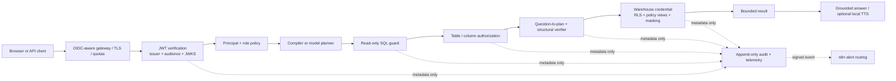

# Enterprise architecture — current control plane and production target

## Scope and assumptions

The product answers analytical questions over governed, read-only warehouse
data. It may use a deterministic compiler or a model to produce SQL; both are
untrusted query authors. Voice is an optional input/output adapter. n8n is an
optional operations subscriber and never authorizes or executes SQL.

This repository remains a single-process reference implementation over
synthetic data. The controls below are real seams for a production service, but
production still requires a durable warehouse with RLS/masked views, an API
gateway, centralized audit/telemetry, and tested multi-instance deployment.

## Requirements

- OIDC identity with issuer, audience, signature, expiry, and subject checks.
- Default-deny role-to-domain/table policy and sensitive-column protection.
- No SQL reaches the database before guard, policy, and semantic verification.
- One request deadline, bounded rows, bounded SQL/question size, bounded model
  retries, bounded query CPU/memory, and no database filesystem/network access.
- Critical KPI definitions are owned, versioned, and tested against expected
  values. Unknown intent is refused rather than guessed.
- Operational telemetry and n8n payloads exclude raw questions, SQL, row values,
  recordings, and API keys. The opt-in reference audit sink retains clipped,
  key-redacted question/SQL lineage; production must place equivalent lineage
  in a classified, encrypted, access-controlled store or retain only hashes.
- Target SLOs and response procedures are defined in `docs/SLO_AND_RUNBOOK.md`.

## Request and trust flow

The browser session ID is explicitly not identity. With `ASK_AUTH_MODE=oidc`,
`engine/access.py` accepts only RS256 JWTs validated against configured JWKS,
issuer, audience, `exp`, `iat`, and `sub`. Unknown roles receive an empty
catalogue. `engine/query.py` is the shared policy-enforcement point for model,
compiler, certified metric, and manual SQL paths.

Application authorization is defense in depth. The production database must
repeat the decision with tenant-bound credentials or session context, RLS,
policy views, and masking. Negative tests must prove both layers deny the same
cross-tenant and restricted-column requests.

## Component boundaries

| Component | Owns | Must not own |
|---|---|---|
| Gateway | TLS, OIDC login, identity rate limits, request ID | SQL or data policy |
| Identity verifier | JWT signature and claims to immutable principal | Browser session identity |
| Policy point | Role grants, sensitive-column decisions, schema filtering | Database-only enforcement claims |
| Retrieval index | Policy-filtered schema/exemplar similarity over a checksum-pinned local model | Business rows, authorization, or network service state |
| Planner | Candidate SQL or refusal | Authorization or final truth |
| Guard/verifier | Read-only shape and known semantic contracts | General proof of business correctness |
| Query service | Deadline/cancellation, row cap, least-privilege DB session | Model prompts |
| Answer renderer | Result-grounded text and optional local speech | New facts or SQL execution |
| Audit/telemetry | Redacted control evidence, SLI events, integrity chain | Raw rows, secrets, recordings |
| n8n | Signed-event classification and routing | Inline approval, SQL, warehouse credentials |
| Product UI | Ask, catalog discovery, trust evidence, transcript review | Hidden policy decisions or invented control status |

## Storage and tenancy target

The reference DuckDB is immutable and process-local. Production should use a
warehouse connection pool whose principal is tenant/purpose scoped. Shared
state—quotas, request idempotency, conversation references, audit delivery
outbox, and model-release metadata—belongs in durable PostgreSQL/Redis-class
services, never Streamlit session state. Audit records should be written through
an outbox to encrypted append-only/WORM storage with daily integrity roots and
retention by data classification.

Conversation storage should retain references and redacted summaries, not raw
row payloads. Tenant ID must participate in every cache key. Retrieval indexes
must be partitioned by policy equivalence class or tenant; filtering only after
retrieval is insufficient for a shared production vector store.

The reference implementation does not run a vector database. Its 71 schema
documents and 39 exemplars use normalized MiniLM vectors and exact cosine search
in read-only NumPy matrices. The model archive and each extracted file have
pinned SHA-256 digests; optional persisted matrices are fingerprinted by corpus
content and loaded with pickle disabled. A larger production catalog may need an
external index, but that is a measured scale trigger rather than a default.

## Reliability and scale

The target service is stateless behind a load balancer. Planner/model calls and
queries consume separate concurrency pools so a slow model cannot starve
keyless traffic. Admission control applies per subject, tenant, and provider
budget. Retries are permitted only for idempotent provider transport failures;
SQL correction remains bounded to three attempts. Cancellation propagates from
gateway to provider and database using the remaining monotonic request budget.

Backups are useful only after restore proof. The production gate requires a
quarterly restore test, zonal failover exercise, and measured RTO/RPO. n8n and
speech are degradation-safe: alert-routing or TTS failure cannot take the
answer path down; STT failure leaves typed input available.

## Security and privacy controls

- JWT algorithms are server-selected, never token-selected; keys are cached
  briefly and refreshed on unknown `kid`.
- Prompt schema is filtered to authorized tables/columns before model access.
- Raw row values are an untrusted data zone. The next production service must
  isolate summarization content and apply output policy before replaying text as
  conversation context.
- Voice recordings are confirmed before execution and are not written to disk.
- Repository, dependency, CodeQL, image vulnerability, secret/misconfiguration,
  and SBOM gates run in CI. Release images must later add signing/attestation.
- The local embedding artifact is checksum pinned. Production still requires a
  model bill of materials, license/provenance review, and an approved artifact mirror.
- n8n events are HMAC signed and privacy minimized. A commercial deployment
  needs a license review because n8n is fair-code, not OSI open source.

## Key trade-offs

| Decision | Benefit | Cost / revisit trigger |
|---|---|---|
| App policy plus database policy | Early refusal and defense in depth | Duplicate rules; replace file policy with a versioned PDP when policies change independently of releases |
| Conservative masking (`SELECT *` denied) | Schema changes cannot widen access silently | More explicit SQL; revisit only with database-native masked views |
| Question-aware deterministic rules | Closes measured silent-wrong cases offline | Does not prove arbitrary intent; add governed plans for every decision-critical KPI |
| Exact local vector matrix | Removes an unnecessary multi-tenant database dependency and produces deterministic rankings | Revisit only when catalog size/latency measurements exceed one-process capacity |
| One 45-second request deadline | Predictable capacity and user feedback | Some local models need more; tune by traffic class within the documented 1–300 second bound |
| Local Speaches voice | No paid key and controllable data path | Model artifact/license/GPU operations remain deployment responsibilities |
| n8n off the answer path | Automation cannot corrupt availability or authorization | Delivery is eventually consistent; production requires an outbox and replay |

## Production completion evidence

The project is not “enterprise-ready” merely because these seams exist. Release
evidence must include real-IdP integration tests, database RLS/masking denial
tests, tenant cache-isolation tests, live-model contracts for a pinned model,
load/soak and failover results, durable audit reconciliation, restore/DR proof,
image signature/provenance, penetration testing, data-governance approvals, and
WCAG 2.2 AA assistive-technology evidence.
